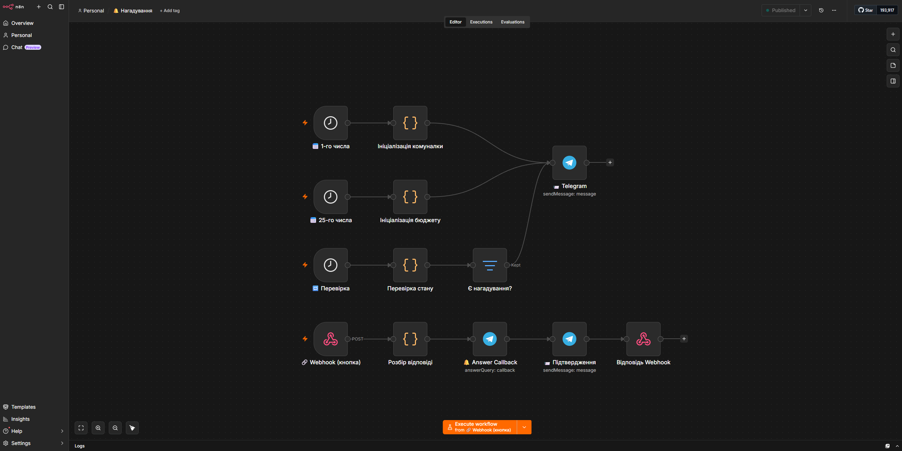
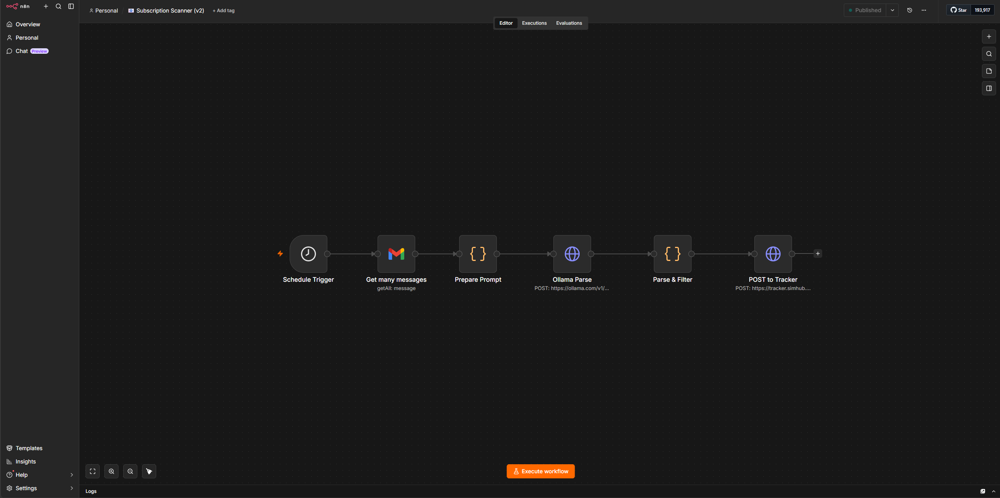
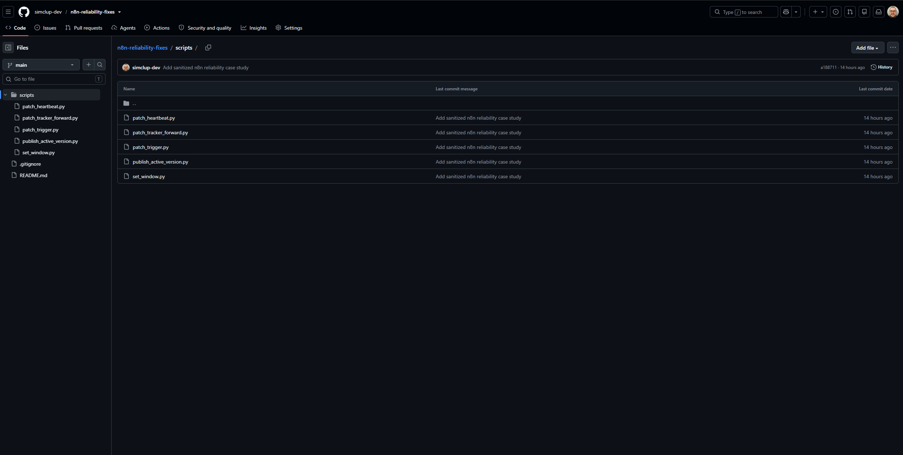

# n8n Automation Reliability Fixes

This repo is a sanitized case-study version of a production debugging job around
an `n8n` reminder workflow that looked fixed in the editor but still behaved
wrong in production.

## What this repo shows

- how to debug the gap between editor state and real runtime state
- how to patch SQLite-backed workflow data carefully and reproducibly
- how to use independent signals instead of trusting the UI alone
- how to turn a one-off production fix into a repeatable operational workflow

## The failure pattern

The workflow had several overlapping issues:

- edits were applied to the draft workflow, while the scheduler still used the active version snapshot
- a Schedule Trigger configuration looked valid in the UI but did not fire reliably in that specific setup
- callback state needed to be shared across workflows, not stored in per-workflow static data
- empty successful runs were hard to prove from execution history alone

## What this repo contains

- small, sanitized Python scripts used to patch workflow JSON in SQLite-backed `n8n`
- examples of safer state-file usage for cross-workflow coordination
- a repeatable workflow for proving whether a trigger really fires

## Screenshots

### Reminder workflow

### Subscription scanner workflow

### Patch scripts

## What this repo intentionally does not contain

- live `n8n` databases
- raw workflow exports
- webhook URLs, credential IDs, or instance-specific paths
- runtime logs and operational artifacts

## Main lessons

1. In `n8n` 2.x, draft edits are not always the same thing as the active version the scheduler runs.
2. A visible UI change is not enough proof that the real runtime changed.
3. Cross-workflow state should live in a shared, mounted file or another explicit shared store.
4. A heartbeat file is a useful independent signal when execution history is incomplete.
5. Production fixes get safer when every patch script creates a backup first.
